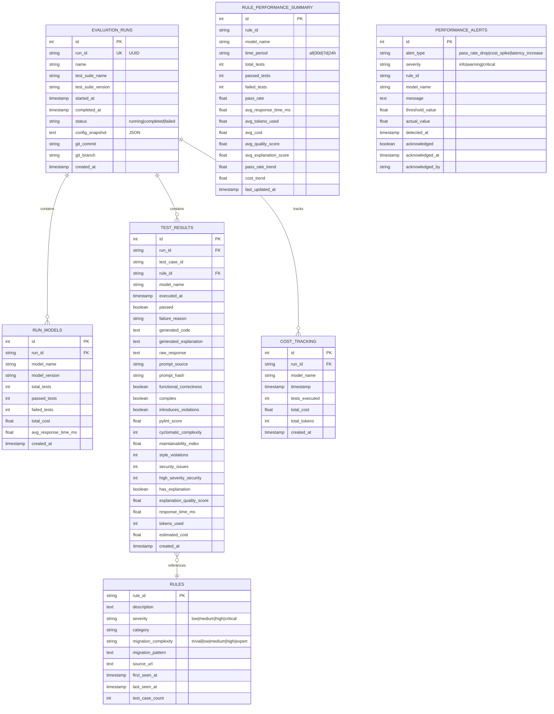

# Database Schema - Entity Relationship Diagram

## ERD (Mermaid Format)



## Table Descriptions

### EVALUATION_RUNS
**Purpose**: Track complete evaluation sessions across one or more models.

**Key Fields**:
- `run_id`: UUID for external reference
- `status`: Tracks run lifecycle (running → completed/failed)
- `config_snapshot`: JSON snapshot of configuration used
- `git_commit`/`git_branch`: Version control tracking

**Relationships**:
- Has many `RUN_MODELS` (which models were tested)
- Has many `TEST_RESULTS` (individual test outcomes)
- Has many `COST_TRACKING` entries

### RUN_MODELS
**Purpose**: Track which models participated in each run and their summary stats.

**Key Fields**:
- `total_tests`, `passed_tests`, `failed_tests`: Aggregate counts
- `total_cost`: Total spend for this model in this run
- `avg_response_time_ms`: Average latency

**Relationships**:
- Belongs to `EVALUATION_RUNS`

### TEST_RESULTS
**Purpose**: Store individual test case outcomes with full metrics.

**Key Fields**:
- `passed`: Overall pass/fail result
- `generated_code`: LLM's fixed code
- `generated_explanation`: Why the fix was made
- `prompt_source`: 'custom', 'config:<migration>', or 'default'
- **Correctness**: `functional_correctness`, `compiles`, `introduces_violations`
- **Quality**: `pylint_score`, `cyclomatic_complexity`, `maintainability_index`
- **Security**: `security_issues`, `high_severity_security`
- **Explainability**: `has_explanation`, `explanation_quality_score`
- **Performance**: `response_time_ms`, `tokens_used`, `estimated_cost`

**Relationships**:
- Belongs to `EVALUATION_RUNS`
- References `RULES` (for metadata)

**Indexes**:
- `(run_id)` - Fast run queries
- `(rule_id, model_name, executed_at)` - Trend analysis
- `(passed)` - Pass rate calculations
- `(executed_at)` - Time-based filtering

### RULES
**Purpose**: Cache rule metadata from test suites.

**Key Fields**:
- `rule_id`: Primary key (e.g., 'jakarta-package-00000')
- `migration_complexity`: AI difficulty level (TRIVIAL → EXPERT)
- `severity`: Impact level (low → critical)
- `test_case_count`: How many tests exist for this rule

**Relationships**:
- Referenced by many `TEST_RESULTS`

**Usage**: Auto-populated when test results are saved. Enables filtering/grouping by complexity.

### RULE_PERFORMANCE_SUMMARY
**Purpose**: Pre-aggregated performance metrics for fast dashboard queries.

**Key Fields**:
- `time_period`: 'all', '30d', '7d', '24h'
- `pass_rate`: Percentage of passed tests
- `pass_rate_trend`: Change vs previous period
- `cost_trend`: Cost change vs previous period

**Unique Constraint**: `(rule_id, model_name, time_period)`

**Usage**: Materialized view pattern - periodically refresh for fast queries.

### COST_TRACKING
**Purpose**: Track spending per evaluation run and model.

**Key Fields**:
- `total_cost`: USD spent
- `total_tokens`: Tokens consumed
- `tests_executed`: Number of tests run

**Relationships**:
- Belongs to `EVALUATION_RUNS`

**Usage**: Cost forecasting, budget tracking, ROI analysis.

### PERFORMANCE_ALERTS
**Purpose**: Store detected anomalies and regressions (future feature).

**Key Fields**:
- `alert_type`: Type of anomaly detected
- `severity`: Impact level
- `threshold_value` vs `actual_value`: What was expected vs observed
- `acknowledged`: Whether alert has been reviewed

**Usage**: Automated monitoring, Slack/email notifications.

## Query Patterns

### Common Queries

**1. Model Comparison (Last 30 Days)**
```sql
SELECT
    model_name,
    COUNT(*) as total_tests,
    SUM(CASE WHEN passed THEN 1 ELSE 0 END) as passed_tests,
    AVG(response_time_ms) as avg_response_time,
    SUM(estimated_cost) as total_cost
FROM test_results
WHERE executed_at >= NOW() - INTERVAL '30 days'
GROUP BY model_name
ORDER BY passed_tests DESC;
```

**2. Rule Performance Trend**
```sql
SELECT
    DATE(executed_at) as date,
    COUNT(*) as total,
    SUM(CASE WHEN passed THEN 1 ELSE 0 END) as passed,
    AVG(response_time_ms) as avg_time
FROM test_results
WHERE rule_id = 'jakarta-package-00000'
    AND model_name = 'gpt-4o'
    AND executed_at >= NOW() - INTERVAL '30 days'
GROUP BY DATE(executed_at)
ORDER BY date;
```

**3. Failing Rules**
```sql
SELECT
    r.rule_id,
    r.description,
    r.migration_complexity,
    COUNT(tr.id) as total_tests,
    SUM(CASE WHEN tr.passed THEN 1 ELSE 0 END) as passed_tests,
    (SUM(CASE WHEN tr.passed THEN 1 ELSE 0 END) * 100.0 / COUNT(tr.id)) as pass_rate
FROM rules r
JOIN test_results tr ON r.rule_id = tr.rule_id
WHERE tr.executed_at >= NOW() - INTERVAL '30 days'
GROUP BY r.rule_id, r.description, r.migration_complexity
HAVING COUNT(tr.id) >= 3
    AND (SUM(CASE WHEN tr.passed THEN 1 ELSE 0 END) * 100.0 / COUNT(tr.id)) < 50
ORDER BY pass_rate;
```

**4. Complexity Breakdown**
```sql
SELECT
    r.migration_complexity,
    COUNT(tr.id) as total_tests,
    SUM(CASE WHEN tr.passed THEN 1 ELSE 0 END) as passed_tests,
    AVG(tr.response_time_ms) as avg_response_time
FROM rules r
JOIN test_results tr ON r.rule_id = tr.rule_id
WHERE tr.model_name = 'gpt-4o'
    AND tr.executed_at >= NOW() - INTERVAL '30 days'
    AND r.migration_complexity IS NOT NULL
GROUP BY r.migration_complexity
ORDER BY
    CASE r.migration_complexity
        WHEN 'trivial' THEN 1
        WHEN 'low' THEN 2
        WHEN 'medium' THEN 3
        WHEN 'high' THEN 4
        WHEN 'expert' THEN 5
    END;
```

**5. Regression Detection**
```sql
WITH recent_perf AS (
    SELECT
        rule_id,
        model_name,
        COUNT(*) as total,
        SUM(CASE WHEN passed THEN 1 ELSE 0 END) * 100.0 / COUNT(*) as pass_rate
    FROM test_results
    WHERE executed_at >= NOW() - INTERVAL '7 days'
    GROUP BY rule_id, model_name
),
historical_perf AS (
    SELECT
        rule_id,
        model_name,
        SUM(CASE WHEN passed THEN 1 ELSE 0 END) * 100.0 / COUNT(*) as pass_rate
    FROM test_results
    WHERE executed_at >= NOW() - INTERVAL '30 days'
        AND executed_at < NOW() - INTERVAL '7 days'
    GROUP BY rule_id, model_name
)
SELECT
    h.rule_id,
    h.model_name,
    h.pass_rate as historical_pass_rate,
    r.pass_rate as recent_pass_rate,
    (h.pass_rate - r.pass_rate) as drop
FROM historical_perf h
JOIN recent_perf r ON h.rule_id = r.rule_id AND h.model_name = r.model_name
WHERE (h.pass_rate - r.pass_rate) >= 10
ORDER BY drop DESC;
```

## Indexes

### Performance-Critical Indexes

```sql
-- Fast run queries
CREATE INDEX idx_runs_started_at ON evaluation_runs(started_at);
CREATE INDEX idx_runs_suite ON evaluation_runs(test_suite_name);

-- Trend analysis (most important!)
CREATE INDEX idx_test_results_composite ON test_results(rule_id, model_name, executed_at);

-- Filtering
CREATE INDEX idx_test_results_rule_id ON test_results(rule_id);
CREATE INDEX idx_test_results_model ON test_results(model_name);
CREATE INDEX idx_test_results_passed ON test_results(passed);
CREATE INDEX idx_test_results_executed_at ON test_results(executed_at);

-- Rule categorization
CREATE INDEX idx_rules_complexity ON rules(migration_complexity);
CREATE INDEX idx_rules_category ON rules(category);

-- Performance summary lookups
CREATE INDEX idx_perf_summary_composite ON rule_performance_summary(rule_id, model_name, time_period);
```

## Storage Estimates

### Per Test Result
- **Row size**: ~2-5 KB (varies with code/explanation length)
- **Indexes**: ~500 bytes overhead

### Typical Workload
- **234 tests × 5 models = 1,170 results per run**
- **Storage per run**: ~3-6 MB
- **100 runs**: ~300-600 MB

### Long-Term (1 Year)
- **Daily evaluations**: 365 runs
- **Storage**: ~1-2 GB (SQLite), ~500 MB-1 GB (PostgreSQL with compression)

## Migration Notes

### SQLite → PostgreSQL

**Differences to handle**:
1. **AUTO_INCREMENT** → **SERIAL**
2. **TEXT** → **TEXT** (same)
3. **TIMESTAMP** → **TIMESTAMP** (same)
4. **Boolean handling**: SQLite stores as 0/1, PostgreSQL has native BOOLEAN

**Migration script** (pseudo-code):
```bash
# Export SQLite
sqlite3 konveyor_iq.db .dump > backup.sql

# Convert syntax
sed 's/AUTOINCREMENT/SERIAL/g' backup.sql > postgres.sql

# Import to PostgreSQL
psql -U konveyor -d konveyor_iq -f postgres.sql
```

## Schema Versioning

**Current Version**: 1.0.0

**Future migrations** (example):
```python
# alembic migration example
def upgrade():
    op.add_column('test_results',
        sa.Column('prompt_version', sa.String(50), nullable=True))
    op.create_index('idx_test_results_prompt_version',
        'test_results', ['prompt_version'])

def downgrade():
    op.drop_index('idx_test_results_prompt_version')
    op.drop_column('test_results', 'prompt_version')
```

## Visual Schema Summary

```
┌─────────────────────┐
│  EVALUATION_RUNS    │
│  ═══════════════    │
│  • run_id (UUID)    │
│  • test_suite_name  │
│  • status           │
│  • git_commit       │
└──────────┬──────────┘
           │
           ├──────────────┬──────────────┬──────────────┐
           │              │              │              │
           ▼              ▼              ▼              ▼
    ┌──────────┐   ┌──────────┐   ┌──────────┐   ┌──────────┐
    │RUN_MODELS│   │TEST_RESU │   │COST_TRACK│   │PERFORMA  │
    │          │   │LTS       │   │ING       │   │NCE_ALERT │
    │• model   │   │• rule_id │   │• cost    │   │• type    │
    │  _name   │   │• passed  │   │• tokens  │   │• severity│
    │• total   │   │• metrics │   │          │   │          │
    │  _tests  │   │• code    │   │          │   │          │
    └──────────┘   └────┬─────┘   └──────────┘   └──────────┘
                        │
                        │ references
                        ▼
                   ┌─────────┐
                   │ RULES   │
                   │         │
                   │• rule_id│
                   │• complex│
                   │  ity    │
                   └─────────┘
```
